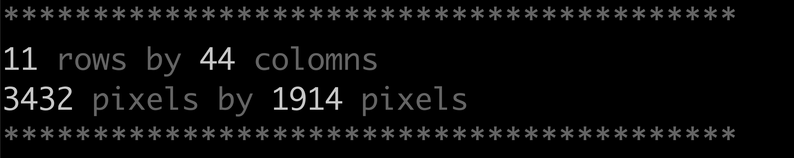

### this program outputs terminal dimensions, rows by columns and pixels by pixels

#### install:
`git clone https://github.com/itonyluke/terminal_dimensions terminal_dimensions`

#### compile:
`gcc terminal_dimensions.c`

#### run:
`./a.out`

###### built and tested on Darwin Kernel Version 21.6.0: Wed Aug 10 14:28:23 PDT 2022; root:xnu-8020.141.5~2/RELEASE_ARM64_T6000 arm64
